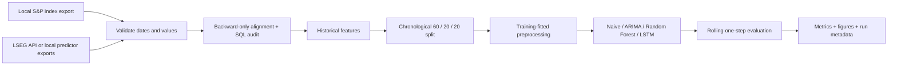
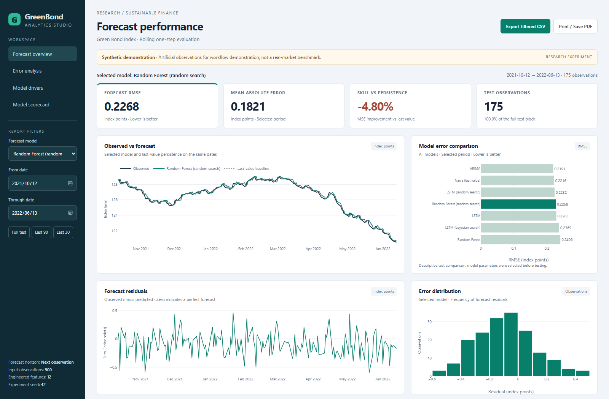
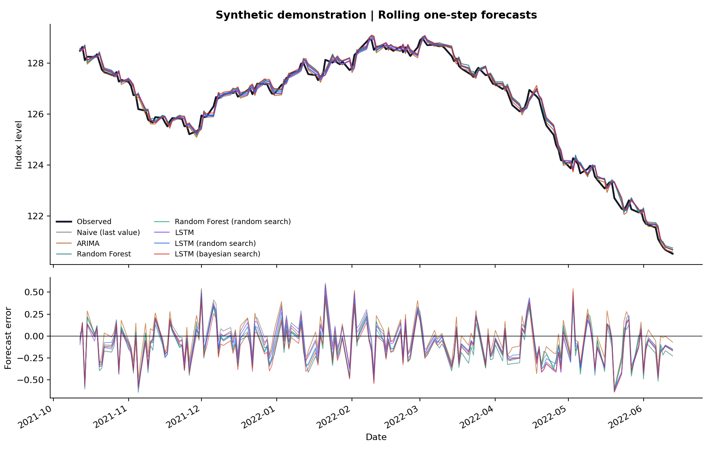
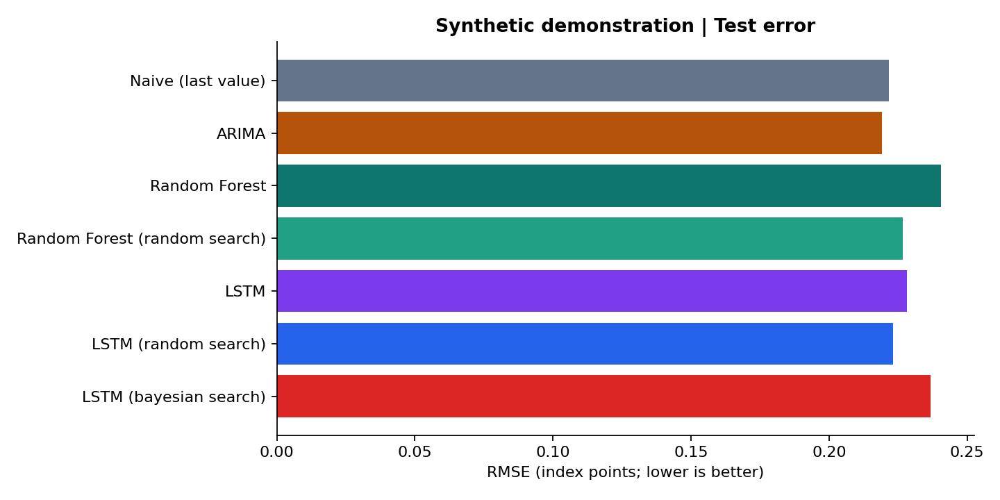

<p align="center">
  
</p>

# Forecasting the Green Bond Index

[](pyproject.toml)
[](https://github.com/huilin-zhang/ForecastGreenBondIndex/actions/workflows/ci.yml)
[](docs/methodology.md)
[](examples/synthetic-demo/report.md)

A reproducible Python project for forecasting the **S&P Green Bond Index** from historical
index levels, market indicators, and macroeconomic data. It connects financial data engineering
to statistical and machine learning forecasts, with an emphasis on chronological evaluation.

**Explore:** [Interactive dashboard](examples/synthetic-demo/dashboard.html) ·
[Example report](examples/synthetic-demo/report.md) ·
[Quickstart notebook](notebooks/01_quickstart.ipynb) ·
[Methodology](docs/methodology.md) · [Data contract](data/README.md)

## What this project demonstrates

- **Financial ETL:** an LSEG API adapter with field fallback, retries, local request caching,
  and an extraction ledger; integration with locally downloaded S&P index data.
- **Python + SQL data quality:** date and value validation, duplicate checks, missing-value
  audits in SQLite, backward-only data alignment, and training-fitted outlier handling.
- **Time-series features:** historical index lags, rolling statistics, returns, and lagged
  financial indicators, constructed without using the forecasted observation.
- **Forecasting:** ARIMA, Random Forest, and optional LSTM, compared with a last-value baseline
  on identical test dates and in original index units.
- **Hyperparameter search:** expanding-window random search for the forest and chronological
  validation with random and Bayesian search for the LSTM.
- **Reproducibility:** an installable CLI, regression tests, CI, dated forecasts, machine-readable
  metrics, run metadata, and exportable comparison figures.

## Pipeline



The forecast uses information through the previous observed index date. ARIMA updates its
state after each forecast; all models can use earlier realized observations for subsequent
one-step forecasts. The test block is reserved for final evaluation.

## Quickstart: no financial API required

Use **Python 3.11 or 3.12**. From the repository root:

```bash
python -m venv .venv
# Windows PowerShell
.venv\Scripts\Activate.ps1
# macOS / Linux: source .venv/bin/activate
python -m pip install -e ".[dev]"
greenbond demo
```

The demo generates artificial data, trains persistence, ARIMA, baseline Random Forest and
random-search Random Forest, and writes a fresh directory under `reports/`. View `report.md`
and the PNG files in `figures/`, or open `dashboard.html` in your browser. No credentials, downloads, or paid services are used.

To include the neural network and both LSTM search methods:

```bash
python -m pip install -e ".[neural,dev]"
greenbond demo --neural --epochs 15 --lstm-trials 4 --rf-trials 8
```

`--lstm-trials` is the budget **for each** of random and Bayesian search. Set it to `0` to run
only baseline LSTM. Set `--rf-trials 0` to omit forest search. Larger budgets take more time.
Outputs must use a fresh directory; the CLI refuses to overwrite an existing experiment.

Or open [the quickstart notebook](notebooks/01_quickstart.ipynb) after installing the `dev` extra.
The neural extra pins NumPy below 2 to match TensorFlow 2.17 binary compatibility.

## Interactive analytics dashboard

The report now includes an English BI-style dashboard with model/date filters, KPI cards,
forecast trends, RMSE comparison, residual analysis, rolling error, and a model scorecard.
Metrics recalculate from the selected test dates. Fixed feature importance and experiment
metadata retain their original scope.



**Open:** Download [the offline dashboard](examples/synthetic-demo/dashboard.html) and open it
in your browser. GitHub's repository viewer shows HTML source; the downloaded file is fully
interactive. It needs no Python, credentials, internet connection, or running server.

Every new experiment includes `dashboard.html` and a long-form `forecast_facts.csv` for Tableau
or Power BI. Export the selected model/date window as CSV, or use **Print / Save PDF**.
See [BI import instructions and measure templates](docs/bi-dashboard.md).

Regenerate the dashboard from an existing experiment without retraining:

```bash
greenbond dashboard --report-dir examples/synthetic-demo
```

## Example results

The committed [example report](examples/synthetic-demo/report.md) is generated from **900 synthetic
observations, seed 42**. It demonstrates the full workflow, including the baseline LSTM and
both search methods. It is **not a benchmark on licensed S&P or LSEG observations**.

| Model | MAE | RMSE | MSE skill vs naive |
| :--- | ---: | ---: | ---: |
| Naive (last value) | 0.1756 | 0.2216 | 0.00% |
| ARIMA | 0.1741 | 0.2191 | 2.20% |
| Random Forest | 0.1955 | 0.2406 | -17.88% |
| Random Forest (random search) | 0.1821 | 0.2268 | -4.80% |
| LSTM | 0.1801 | 0.2283 | -6.17% |
| LSTM (random search) | 0.1767 | 0.2232 | -1.53% |
| LSTM (bayesian search) | 0.1914 | 0.2369 | -14.31% |





MAE and RMSE are in index points. MSE skill is `1 - model_MSE / naive_MSE`; positive values
beat last-value persistence. Model selection uses training or validation data, never this
comparison table. A high R2 alone is insufficient evidence of forecast skill, and tuning
can improve or worsen held-out performance.

Reproduce the example in a new directory:

```bash
greenbond demo --rows 900 --seed 42 --neural --epochs 15 --lstm-trials 4 --rf-trials 8 --output reports/reproduced-demo
```

Exact results can vary across hardware and dependency versions. The example's
[run metadata](examples/synthetic-demo/run.json) records its installed package versions,
split dates, input fingerprint, tuning budgets, selected parameters, and model runtime.

## Run with your own data

### Original project exports

Place your entitled local exports in ignored `Data/`:

```text
Data/
  SPgreenbondindex.xls
  predictors.xlsx
  predictors_mon.xlsx
```

```bash
greenbond legacy --data-dir Data --macro-lag-days 45
greenbond legacy --data-dir Data --macro-lag-days 45 --neural --epochs 30 --lstm-trials 8
```

The monthly observation dates are shifted by an explicit 45-calendar-day availability
assumption before alignment. Genuine release timestamps and unrevised vintage data are
preferable; an assumed lag does not fix future revision bias.

### Standard CSV input

A combined CSV contains `date`, `green_bond_index`, and optional numeric predictors.
See [the data contract](data/README.md) for required timing and validation rules.

```bash
greenbond run --input data/processed/combined.csv
```

To integrate separate inputs:

```bash
greenbond prepare --target data/raw/index.csv --daily data/raw/predictors.csv --monthly data/raw/macro.csv --macro-lag-days 45 --output data/processed/combined.csv
```

### LSEG extraction

API access is optional and requires your existing LSEG entitlement and an active Workspace
session. Instrument RICs and fields in the example configuration must be verified for your
account. The [official setup guide](https://developers.lseg.com/en/api-catalog/lseg-data-platform/lseg-data-library-for-python/quick-start/getting-started-with-python)
explains desktop sessions and application keys.

```bash
python -m pip install -e ".[lseg]"
# Copy config/lseg-data.config.example.json to Data/lseg-data.config.json.
# Supply your application key in that ignored local file.
greenbond extract --start 2015-01-30 --end 2025-02-14 --config Data/lseg-data.config.json
```

The extractor saves `data/raw/lseg/daily.csv`, individual cached series, and `extraction.json`.
It fails explicitly if any configured instrument cannot be retrieved; successful requests
remain cached for a retry. S&P target data are supplied separately as a local export.
Live extraction is an explicit CLI action; demos and tests never open an API session.

## Repository guide

```text
src/greenbond/       Validated ETL, causal features, models, CLI, reporting
config/             Credential-free configuration examples
notebooks/          Small public quickstart
examples/           Committed synthetic metrics, forecasts, and figures
tests/              Temporal-integrity, preprocessing, extraction, and pipeline tests
docs/               Methodology, notebook review, and portfolio description
greenbond.ipynb     Original exploratory notebook, preserved for provenance
Data/               Ignored original licensed exports and local API configuration
reports/            Ignored local experiments and verification artifacts
```

The original exploratory notebook has methodological issues documented in
[the notebook review](docs/original-notebook-review.md). Its historical saved outputs are
not the revised project's benchmark. Existing historical tuner files are also retained;
new experiments do not load them.

## Verification

The offline dashboard was also checked in a browser for model/date filters, metric parity,
CSV download, invalid-range handling, and mobile layout.

Local regression tests, when the local `tests/` directory is available:

```bash
python -m pytest -q
```

Tests verify that future observations cannot change earlier forecast features, transforms
use training statistics, monthly observations respect the assumed availability date, conflicting
duplicates are rejected, API caching/fallbacks behave correctly, and models score identical
test dates. CI runs a credential-free reporting smoke experiment on Python 3.11/3.12 and
checks dashboard generation, BI table structure, and metric consistency. The local `tests/`
directory remains excluded from Git by the repository settings; CI runs that suite when included.
Neural models are verified separately with the full demo command above; live API requests
require an entitled session and are not exercised by mock contract tests.

## Scope and evidence

This is a research and portfolio project. The workflow currently evaluates one chronological
holdout per run; repeated windows, repeated seeds, uncertainty estimates, and economic value
analysis are future extensions. Market data release times, revised macro data, and different
market close times require care in any real-data study.

The original project description mentions **20% less processing time** and **10% greater
prediction accuracy**. Those figures require matched benchmarks that are not currently
available, so they are not presented as verified achievements. See the
[portfolio description](docs/portfolio-description.md) for evidence-aligned resume wording.

Data sources: [S&P Green Bond Index](https://www.spglobal.com/spdji/en/indices/sustainability/sp-green-bond-index/#overview)
and [LSEG Data Library](https://developers.lseg.com/en/api-catalog/lseg-data-platform/lseg-data-library-for-python).
Provider datasets and credentials are excluded from new public artifacts. No new license
is assigned to the repository by this update; vendor data remain subject to provider terms.
