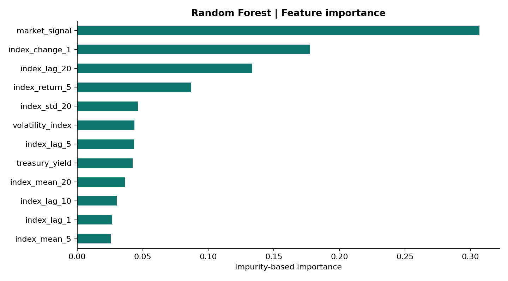

# Forecasting the Green Bond Index: experiment report

**Data:** Synthetic demonstration. **Horizon:** next observed index date. **Test observations:** 175.

All models forecast the same dates in original index units. Predictors are shifted by one observation.
Parameters and preprocessing use training data; LSTM early stopping and search use validation only.
ARIMA state updates after each forecast, without parameter refitting. Prior test observations become
available for subsequent one-step forecasts. This is not a fixed-origin multistep forecast.

| Model | MAE | RMSE | R2 | MSE skill vs naive |
| :--- | ---: | ---: | ---: | ---: |
| Naive (last value) | 0.1756 | 0.2216 | 0.9887 | 0.00% |
| ARIMA | 0.1741 | 0.2191 | 0.9890 | 2.20% |
| Random Forest | 0.1955 | 0.2406 | 0.9867 | -17.88% |
| Random Forest (random search) | 0.1821 | 0.2268 | 0.9882 | -4.80% |
| LSTM | 0.1801 | 0.2283 | 0.9880 | -6.17% |
| LSTM (random search) | 0.1767 | 0.2232 | 0.9885 | -1.53% |
| LSTM (bayesian search) | 0.1914 | 0.2369 | 0.9871 | -14.31% |

Positive skill means lower MSE than last-value persistence; negative skill means worse.
High R2 on persistent index levels does not establish economically useful forecasting skill.

## Reproducibility

See [run metadata](run.json), [metrics](metrics.csv), and [dated predictions](predictions.csv).
Feature importance describes the fitted forest and is not causal evidence. Synthetic results
are a software demonstration, not evidence of performance on the S&P Green Bond Index.
